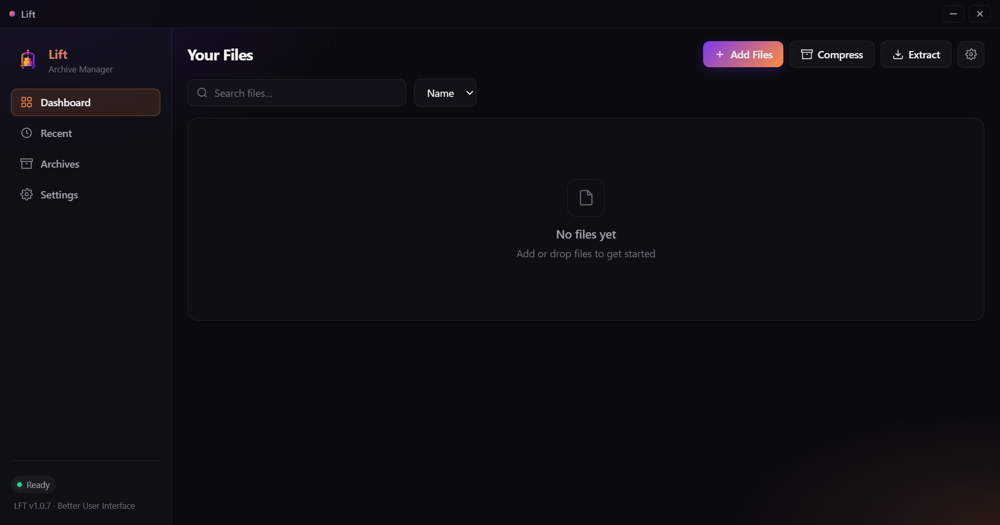
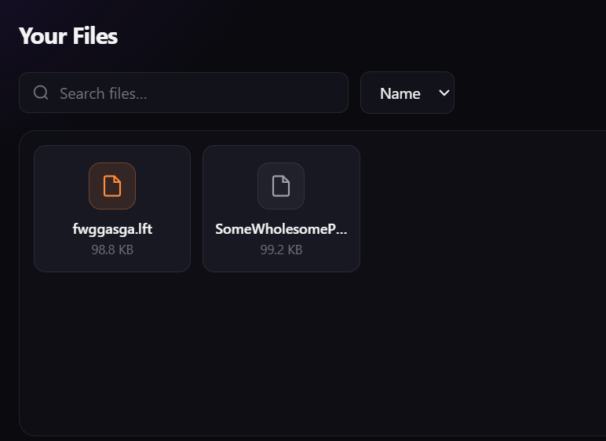

# Lift™ — LFT Archive Manager

**Lift** is a desktop archive manager that compresses and extracts files using the custom **`.lft`** format.

> It “lifts” your packages for you.

---

## Disclaimer

Lift (`.lft`) is an independent file format created by [**TrueVelocity**](https://github.com/TrueVelocity).

We are **not** affiliated with, endorsed by, or connected to PKWARE™ or the creators of the `.zip` format.

---

## A question people keep asking

### Am I allowed to copy your project?

<div align="center">

**↓↓↓ Check out my answer ↓↓↓**

<br/>

**Nah. It’s protected by my own license.**

</div>

---

## What is Lift?

Lift is a file compression and archive manager built with **Electron**.

- Add or drag & drop files
+ or
- Select what you want.
- **Compress** into a `.lft` archive  
- **Extract** `.lft` archives back to a folder  
- **Inspect** what’s inside an archive  
- Track activity under **Recent** and **Archives**

`.lft` is **not** a renamed ZIP. Archives use a custom container with a Lift magic header, with compressed payload data under the hood.

---

## Features

| Feature | Description |
|--------|-------------|
| **Compress** | Pack selected files into a `.lft` archive |
| **Extract** | Unpack a `.lft` archive to a folder of your choice |
| **Inspect** | Preview files inside a `.lft` without extracting |
| **Recent** | History of compress / extract actions |
| **Archives** | List of `.lft` archives you’ve created |
| **Drag & drop** | Drop files straight onto the window |
| **Themes** | Background presets + custom color |
| **Frameless UI** | Clean dark interface with custom window controls |

---

---

## Screenshots






```bash
git clone https://github.com/YOUR_USERNAME/YOUR_REPO.git
cd YOUR_REPO
npm install
npm start
```
